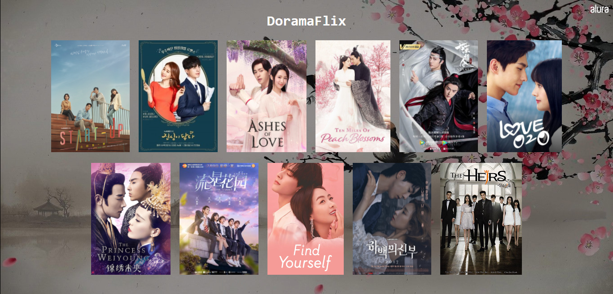
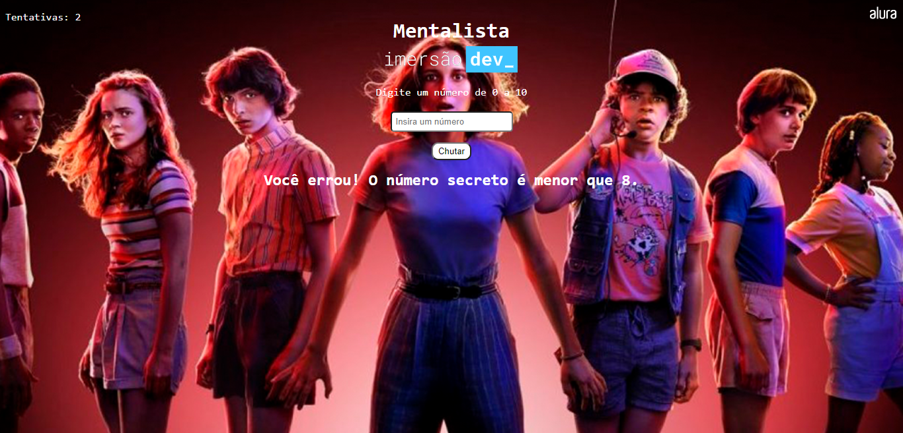
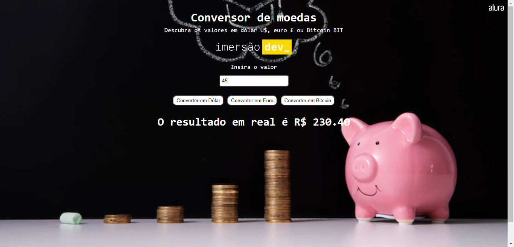
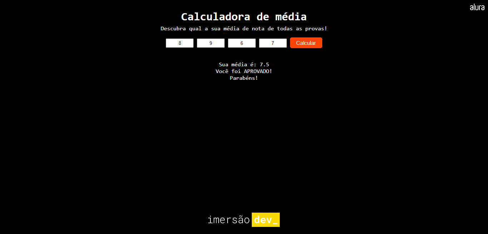
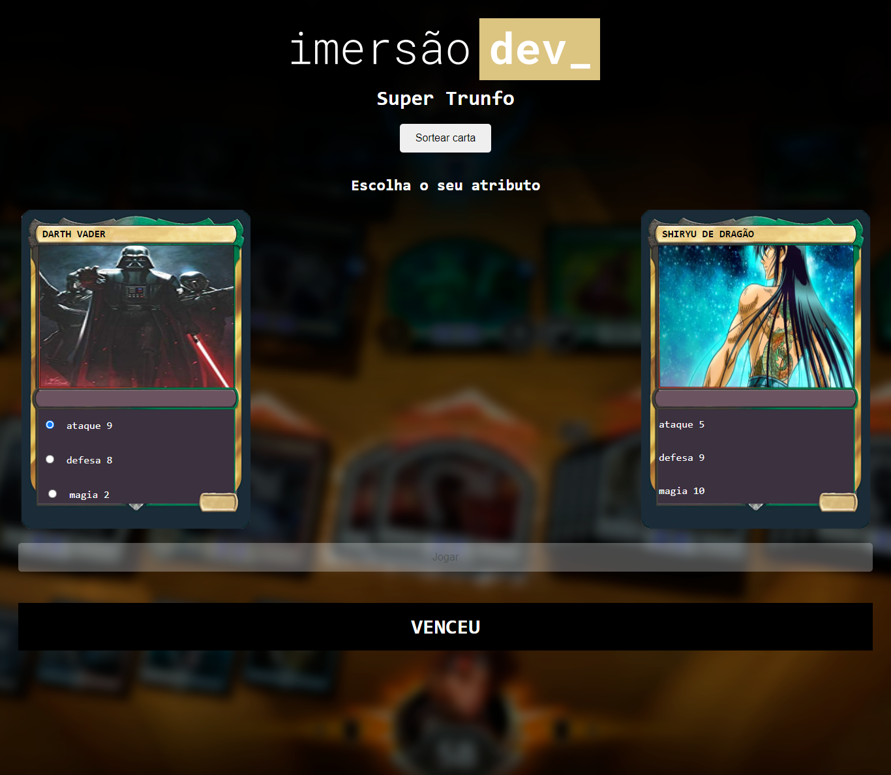

<h1 align="center">
  📓 Imersão Dev - Alura
</h1>

  <a href="#-tecnologias">Tecnologias</a>&nbsp;&nbsp;&nbsp;|&nbsp;&nbsp;&nbsp;
  <a href="#-projetos">Projetos</a>&nbsp;&nbsp;&nbsp;|&nbsp;&nbsp;&nbsp;
  <a href="#memo-licença">Licença</a>

  
  

 

## 📖 Descrição

Esses projetos são desafios que foram desenvolvidos durante duas semanas do evento Imersão Dev da Alura.

## 🚀 Tecnologias

Esses projetos foram desenvolvidos com as seguintes tecnologias:

- HTML
- CSS
- JavaScript

## 🚧 Projetos

<h3><strong>Doramaflix</strong></h3>

O desafio proposto era criar um catálogo de filmes ou séries como uma Netflix. Ao clicar na mídia escolhida é possível ver uma sinopse em forma de modal e retornar para o menu principal.

 

<h3><strong>O Mentalista</strong></h3>

Aplicação que sorteia aleatoriamente um número de 0 a 10 e o usuário tem até 3 chances para tentar acertar o número sorteado.

 

<h3><strong>Conversor de Moedas</strong></h3>

Aplicação que converte um valor (dólar, euro ou bitcoin) em reais.

 

<h3><strong>Calculadora de Média</strong></h3>

Aplicação que calcula a média aritmética das notas de um aluno.

 

<h3><strong>Super-Trunfo</strong></h3>

Aplicação que simula o jogo super-trunfo.

 

<h3><strong>Tabela de Classificação</strong></h3>

Tabela de classificação onde é possível fazer a contabilidade de um jogo ao clicar no botão referente a pontuação de cada jogador.

## 📝 Licença

Esse projeto está sob a licença MIT. Veja o arquivo [LICENSE](.github/LICENSE) para mais detalhes.

---

Feito com ♥ by Vitoria Nobre